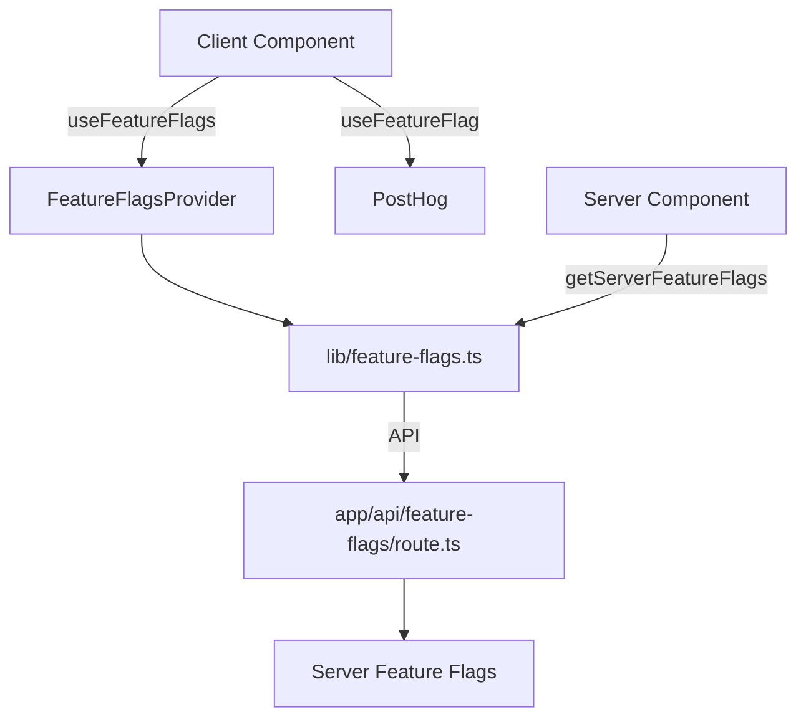

# Feature Flags and Analytics Guardrails

Jovie uses a hybrid feature flag system combining [Statsig](https://statsig.com/) for experimentation and [PostHog](https://posthog.com/) for analytics-driven feature flags. This document provides comprehensive guidance on using feature flags in the Jovie codebase.

## Architecture Overview

The feature flag system consists of:

1. **Statsig** - Primary feature flag management platform
2. **PostHog** - Analytics and experimentation platform
3. **Custom TypeScript layer** - Type-safe access to all feature flags
4. **API endpoints** - Server-side feature flag resolution



## Naming Policy

Feature flags follow a strict naming convention:

1. **Client/Server Flags**: Use `camelCase` in TypeScript code (e.g., `artistSearchEnabled`)
2. **Statsig Gates**: Use `snake_case` in Statsig dashboard (e.g., `waitlist_enabled`)
3. **PostHog Experiments**: Use `feature_` prefix with `snake_case` (e.g., `feature_claim_handle`)
4. **Analytics Guardrails**: Use `feature` prefix with descriptive name (e.g., `featureClickAnalyticsRpc`)

### Naming Rules

- Be descriptive and specific (e.g., `artistSearchEnabled` not `searchEnabled`)
- Use boolean verbs for gates (`isEnabled`, `shouldShow`)
- Use nouns for configurations (`artistSearchConfig`)
- Include feature area as prefix for organization (`auth_require_2fa`)

## Sources

Feature flags come from multiple sources:

### Server Flags

Server flags are defined in `lib/feature-flags.ts` and exposed via the `/api/feature-flags` endpoint:

```typescript
// Default feature flags (fallback)
const defaultFeatureFlags: FeatureFlags = {
  artistSearchEnabled: true,
  debugBannerEnabled: false,
  tipPromoEnabled: true,
  pricingUseClerk: false,
  universalNotificationsEnabled: process.env.NODE_ENV === 'development',
  featureClickAnalyticsRpc: false,
};
```

### PostHog Experiments

PostHog experiments are defined in the PostHog dashboard and accessed via the `useFeatureFlag` hook:

```typescript
// Feature flag constants for type safety
export const FEATURE_FLAGS = {
  CLAIM_HANDLE: 'feature_claim_handle',
} as const;
```

## Privacy Defaults

Feature flags follow privacy-by-design principles:

1. **Default Off**: All feature flags default to `false` unless explicitly enabled
2. **Development Mode**: Some flags (`universalNotificationsEnabled`) default to `true` only in development
3. **Analytics Guardrails**: Analytics features default to `false` and require explicit opt-in

### Consent Gating

Analytics-related feature flags are gated by user consent:

```typescript
// Example of consent-gated analytics
const consent = { essential: true, analytics: false, marketing: false };

// Only track if analytics consent is given
if (consent.analytics && flags.featureClickAnalyticsRpc) {
  // Log analytics event
}
```

The `CookieModal` component manages user consent preferences, which are then used to gate analytics features.

## Lint Rule

The codebase enforces feature flag best practices through ESLint rules:

1. **Direct Access Prevention**: Prevents direct access to feature flags without using the proper hooks
2. **Type Safety**: Ensures all feature flags are properly typed
3. **Naming Convention**: Enforces the naming policy

To add a new feature flag:

1. Add the flag to the `FeatureFlags` interface in `lib/feature-flags.ts`
2. Add the flag to `defaultFeatureFlags` with a safe default value
3. Add the flag to the API endpoint in `app/api/feature-flags/route.ts`
4. Update the `FeatureFlagsContext` in `components/providers/FeatureFlagsProvider.tsx`

## Testing Strategy

### Unit Tests

When testing components that use feature flags:

```typescript
import { render, screen } from '@testing-library/react';
import { FeatureFlagsProvider } from '@/components/providers/FeatureFlagsProvider';

// Mock feature flags for testing
const mockFlags = {
  artistSearchEnabled: true,
  debugBannerEnabled: false,
  // other flags...
};

const TestWrapper = ({ children }: { children: React.ReactNode }) => (
  <FeatureFlagsProvider initialFlags={mockFlags}>
    {children}
  </FeatureFlagsProvider>
);

test('component shows when flag is enabled', () => {
  render(
    <TestWrapper>
      <MyComponent />
    </TestWrapper>
  );

  expect(screen.getByText('Feature enabled')).toBeInTheDocument();
});
```

### E2E Tests

For end-to-end tests, you can configure feature flags per test:

```typescript
test('waitlist flow with flag enabled', async ({ page }) => {
  // Configure feature flags for this test
  await page.addInitScript(() => {
    window.localStorage.setItem('featureFlags', JSON.stringify({
      artistSearchEnabled: true,
      // other flags...
    }));
  });

  await page.goto('/');
  await expect(page.locator('[data-testid="artist-search"]')).toBeVisible();
});
```

## Usage Examples

### Server Component Usage

```typescript
// app/dashboard/page.tsx
import { getServerFeatureFlags } from '@/lib/feature-flags';

export default async function DashboardPage() {
  const flags = await getServerFeatureFlags();
  
  return (
    <div>
      {flags.artistSearchEnabled && <ArtistSearchServer />}
      <DashboardClient />
    </div>
  );
}
```

### Client Component Usage

```typescript
// components/dashboard/DashboardClient.tsx
'use client';

import { useFeatureFlags } from '@/components/providers/FeatureFlagsProvider';

export function DashboardClient() {
  const { flags } = useFeatureFlags();
  
  return (
    <div>
      {flags.tipPromoEnabled && <TipPromotion />}
      {flags.universalNotificationsEnabled && <NotificationCenter />}
    </div>
  );
}
```

### PostHog Feature Flag Usage

```typescript
// components/home/HomeHero.tsx
'use client';

import { useFeatureFlag, FEATURE_FLAGS } from '@/lib/analytics';

export function HomeHero() {
  const { enabled: claimHandleEnabled } = useFeatureFlagWithLoading(
    FEATURE_FLAGS.CLAIM_HANDLE,
    false
  );
  
  return (
    <div>
      {claimHandleEnabled && <ClaimHandleButton />}
    </div>
  );
}
```

## Available Feature Flags

### Core Feature Flags

| Flag Name                      | Type    | Description                           | Default                 |
|-------------------------------|---------|---------------------------------------|-------------------------|
| `artistSearchEnabled`         | Boolean | Controls artist search functionality   | `true`                  |
| `debugBannerEnabled`          | Boolean | Controls debug banner visibility       | `false`                 |
| `tipPromoEnabled`             | Boolean | Controls tip promotion features        | `true`                  |
| `pricingUseClerk`             | Boolean | Use Clerk for pricing                  | `false`                 |
| `universalNotificationsEnabled` | Boolean | Enable universal notifications       | `development` only      |
| `featureClickAnalyticsRpc`    | Boolean | Use RPC for click analytics            | `false`                 |

### Statsig Gates

| Flag Name              | Type   | Description                      | Default             |
|------------------------|--------|----------------------------------|---------------------|
| `waitlist_enabled`     | Gate   | Controls waitlist functionality  | `false`             |
| `debug_banner_enabled` | Gate   | Controls debug banner visibility | `development`       |
| `artist_search_config` | Config | Artist search configuration      | `{ enabled: true }` |
| `tip_promo_config`     | Config | Tip promotion configuration      | `{ enabled: true }` |

### PostHog Experiments

| Flag Name              | Type      | Description                    | Default             |
|------------------------|-----------|--------------------------------|---------------------|
| `feature_claim_handle` | Experiment| Enable handle claiming feature | `false`             |

## TypeScript Types

Feature flag types are exported from `@/types`:

```typescript
// types/index.ts
export * from './common';
export * from './db';
export * from './feature-flags';
```

```typescript
// types/feature-flags.ts
export interface FeatureFlags {
  artistSearchEnabled: boolean;
  debugBannerEnabled: boolean;
  tipPromoEnabled: boolean;
  pricingUseClerk: boolean;
  universalNotificationsEnabled: boolean;
  featureClickAnalyticsRpc: boolean;
}

export type FeatureFlagName = keyof FeatureFlags;
```

## Analytics Guardrails

Analytics guardrails protect user privacy and ensure compliance with data protection regulations:

1. **Consent-Based Collection**: Analytics data is only collected when users explicitly consent
2. **Feature Flag Control**: Analytics features can be toggled via feature flags
3. **RPC Security**: Sensitive analytics operations use `SECURITY DEFINER` RPC functions
4. **Data Minimization**: Only essential data is collected, with sensitive fields redacted

### Analytics Implementation

The `track` API route demonstrates analytics guardrails in action:

```typescript
// app/api/track/route.ts
export async function POST(request: NextRequest) {
  // ...
  const flags = await getServerFeatureFlags();

  if (flags.featureClickAnalyticsRpc) {
    // Use SECURITY DEFINER RPC to safely log click events for anonymous users
    const { data: clickId, error: rpcError } = await supabase.rpc(
      'log_click_event',
      {
        handle,
        link_type: linkType,
        target,
        ua: userAgent,
        platform: platformDetected,
        link_id: linkId ?? null,
      }
    );
    // ...
  } else {
    // Fallback (flag OFF): previous direct insert semantics
    // ...
  }
}
```

## Best Practices

1. **Always provide defaults**: Use fallback values for all feature flags
2. **Test both states**: Test components with flags enabled and disabled
3. **Use descriptive names**: Make flag names self-documenting
4. **Document changes**: Update this file when adding new flags
5. **Monitor usage**: Use analytics to track flag usage
6. **Privacy first**: Default to privacy-preserving options
7. **Type safety**: Use TypeScript interfaces for all feature flags

## Troubleshooting

### Flag not working?

1. Check that environment variables are set correctly
2. Verify the flag exists in the appropriate system (Statsig/PostHog)
3. Check browser console for errors
4. Ensure the component is wrapped in `FeatureFlagsProvider`

### Performance issues?

1. Feature flags are cached locally for performance
2. Use `useFeatureFlags()` hook for real-time updates
3. Consider using server-side flags for critical features

## Resources

- [Statsig Documentation](https://docs.statsig.com/)
- [PostHog Feature Flags](https://posthog.com/docs/feature-flags)
- [Next.js App Router](https://nextjs.org/docs/app)
- [Feature Flag Best Practices](https://docs.statsig.com/guides/feature-flags)

