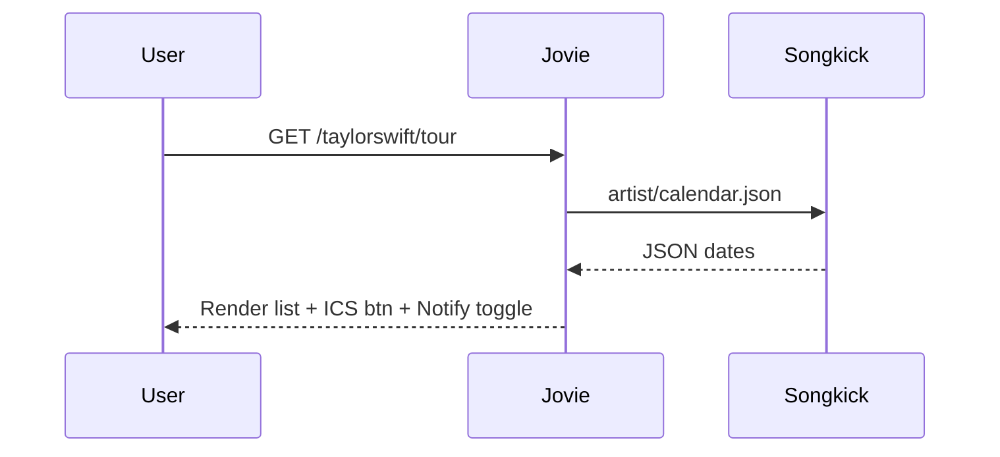

# Tour Dates Feature - Jovie

> **Scope:** Geo‑aware tour banner on artist profile, dedicated `/artist/tour` page, "Add to Calendar" action, and Smart Notifications toggle. 1st implementation supports Songkick data source, deploys on Vercel, and respects Clerk auth context.

---

## 1 · User Flows

### a) Profile Banner (`/artist`)

```mermaid
flowchart LR
  subgraph Render
    A[Load /taylorswift] --> B[Geo‑lookup IP→city]
    B --> C{upcoming date <100 mi?}
    C -- yes --> D[Banner: "🎟 Sept 3 · Inglewood (8 mi)" + CTA]
    C -- no  --> E[Nothing]
  end
```

- **Tap CTA** → smooth‑scrolls to Tour section (if on same page) or opens `/artist/tour`.

### b) Tour Page (`/artist/tour`)



---

## 2 · UI Components

### `<TourBanner>`

| Prop         | Type   | Default |
| ------------ | ------ | ------- |
| `date`       | Date   | –       |
| `distanceKm` | Number | –       |
| `city`       | String | –       |

_Fixed height 56 px, Tailwind `rounded-xl bg-primary/5 backdrop-blur`._

### `<TourList>`

Renders `ul` of `<TourDateCard>` sorted by date ascending.

#### `<TourDateCard>` spec

| Element                  | Treatment                                                            |
| ------------------------ | -------------------------------------------------------------------- |
| Date block               | Large **SF Pro Display, 20/28**, month abbreviated                   |
| Venue/City               | Subhead, 14/20, `text-gray-11`                                       |
| **Add to Calendar** icon | `lucide:calendar-plus` right‑aligned; on tap → triggers ICS download |
| Divider                  | 1 px `gray-4` between items                                          |

### `<SmartNotifyToggle>`

- Inline switch following tour list header → "Ping me when a new show near LA or price drops >10 %."
- Saves to `supabase.profile_prefs.notify_tour=true`.

---

## 3 · Add to Calendar (ICS)

```ts
// Next 16 API route
import { writeFileSync } from 'node:fs';
export async function GET(request) {
  const { dtstart, title, url, venue } = getQuery(request);
  const ics = `BEGIN:VCALENDAR\nBEGIN:VEVENT\nDTSTART:${dtstart}\nSUMMARY:${title} at ${venue}\nURL:${url}\nEND:VEVENT\nEND:VCALENDAR`;
  return new Response(ics, { headers: { 'Content-Type': 'text/calendar' } });
}
```

Downloaded file auto‑opens Apple Calendar / Google Cal.

---

## 4 · Smart Notifications Logic

```pseudo
if (new_date.distance_to(user) < 100km || price_drop >= 10%)
    send_push("Taylor just announced Inglewood · tickets from $120")
```

Runs via Supabase Edge Function cron (hourly) comparing latest Songkick snapshot with previous cache.

---

## 5 · Design Language

- **Apple‑level minimalism**: generous white‑space, subtle shadows (Tailwind `shadow-sm`), haptic‑like micro‑interactions via `framer‑motion` fade‑lift on card press.
- **Linear‑grade typography**: SF Pro 15/22 body, 17/24 section heads, weight semi‑bold. Use accent color derived from artist’s dominant album art (computed via `@dts/css‑palette`).
- **Motion**: list cards slide‑in `opacity 0→100`, `translateY 8→0` over 150 ms.

---

## 6 · API & DB

| Table         | Columns                                                                 |
| ------------- | ----------------------------------------------------------------------- |
| `tour_dates`  | id, artist_id, start_date, venue, city, lat, lon, ticket_url, price_low |
| `price_cache` | date_id, price_low_prev                                                 |

### Rate limits

- Songkick Free: 10 k req/day → we batch fetch 1×/24 h/artist.

---

## 7 · Edge Cases

- **No dates:** Show "No upcoming shows" placeholder, + CTA to follow on Bandsintown.
- **Ticket sold out:** replace Add‑to‑Calendar with small `SOLD OUT` badge.
- **User not location‑shared:** fall back to nearest top market (e.g., LA/NYC) via IP DB guess.

---

## 8 · Roll‑out

1. **Phase 1** – Static list & banner (no price pulse).
2. **Phase 2** – ICS + Notification toggle.
3. **Phase 3** – Price drop detection.
